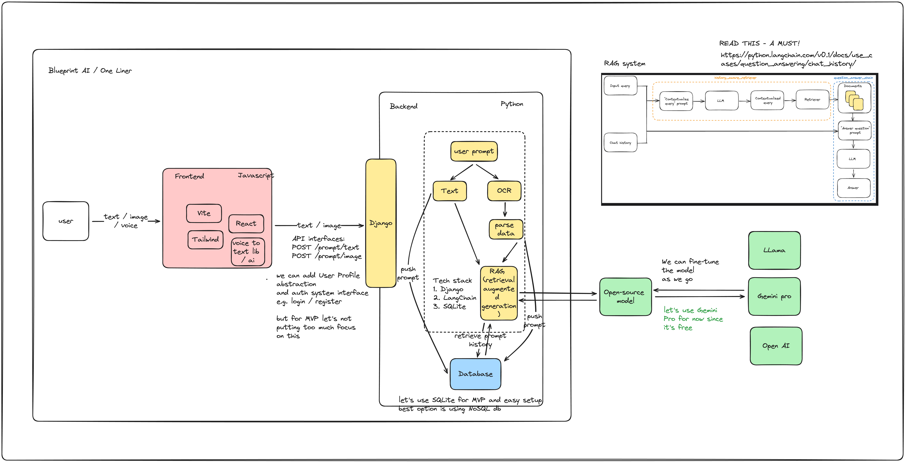

# OneLiner
Hello, welcome to OneLiner project The AI assistant - more description incoming!

# Project Architecture and Tech Stack
This repo adopt monorepo structure, which includes both Frontend and Backend code.

## Architecture

## Tech Stack
For Frontend we use
- Vite
- React
- Typescript

For Backend we use
- Python
- Django
- LangChain
- Gemini (as LLM)

# How to run this project
## Frontend
Please follow README inside `/frontend` folder

## Backend
Please follow README inside `/backend` folder